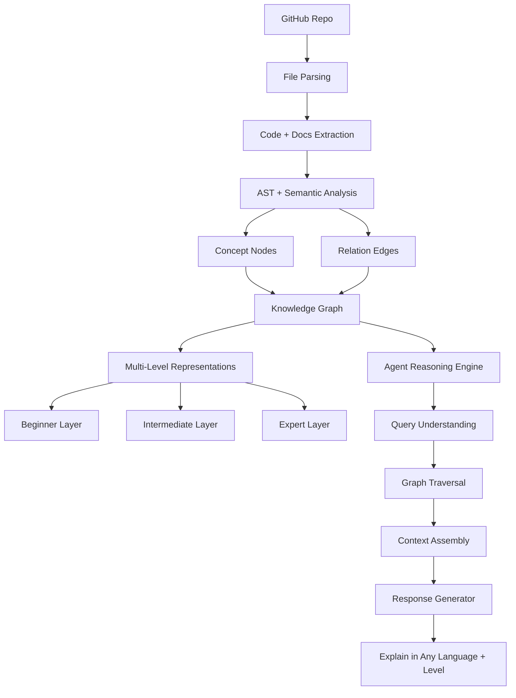

# typercut — SpeedTyper Spec

## Overview

A focused speed-typing practice app. The core loop: AI generates text on a topic you choose → you type it → you see your stats.

## Stack

- React 19 + TypeScript
- Vite
- Tailwind CSS v4
- Storybook (component dev + docs)
- Anthropic SDK (`claude-opus-4-6`, `dangerouslyAllowBrowser`)

## User Flow

```
[Topic Input] → [Generate] → [Typing Exercise] → [Results] → [Try Again / New Topic]
```

## Components

### `TextGenerator`

Inputs:
- **Topic** — free text (e.g. "React hooks", "Japanese history", "Go concurrency")
- **Style** — `prose` | `quotes` | `code` (default: `prose`)
- **Length** — `short` (~30 words) | `medium` (~60 words) | `long` (~120 words)

Behavior:
- Calls Claude to generate a typing-appropriate passage on the topic
- Shows a loading state while generating
- Surfaces errors (missing API key, network failure)

Claude prompt strategy:
- System: "Generate a typing exercise. Use clear, accurate, engaging language. No markdown, no headers. Return only the text to type."
- User: "Topic: {topic}. Style: {style}. Target length: {length} words."

### `SpeedTyper`

Props: `text: string`, `onComplete: (stats: TypingStats) => void`

State machine:
- `idle` — shows text, cursor at position 0, waiting for first keypress
- `typing` — timer running, user entering characters
- `done` — all characters correctly typed; shows stats + actions

Keyboard handling:
- Any printable character → record correct/incorrect vs expected char
- `Backspace` → undo last character (correcting is allowed)
- `Escape` → reset to idle
- Incorrect characters allowed (marked red) — user must backspace to fix or continue
- Completion triggers only when all characters are correct

Display:
- Monospace font, characters colored: gray (pending) / green (correct) / red (incorrect)
- Blue underline cursor on current position
- Live WPM and accuracy stats while typing

### `ResultsPanel`

Shows on completion:
- **WPM** — gross WPM: (total chars typed / 5) / elapsed minutes
- **Accuracy** — correct keypresses / total keypresses × 100%
- **Time** — elapsed seconds
- Actions: "Try Again" (same text) | "New Text" (back to generator)

## Data Types

```ts
type TextStyle = 'prose' | 'quotes' | 'code';
type TextLength = 'short' | 'medium' | 'long';
type TypingState = 'idle' | 'typing' | 'done';

interface TypingStats {
  wpm: number;
  accuracy: number;
  durationSeconds: number;
  totalKeystrokes: number;
  correctKeystrokes: number;
}

interface CharState {
  char: string;
  status: 'pending' | 'correct' | 'incorrect';
}
```

## Environment

```
VITE_ANTHROPIC_API_KEY=sk-ant-...
```

The API key is read from `import.meta.env.VITE_ANTHROPIC_API_KEY`. The Anthropic client is initialized with `dangerouslyAllowBrowser: true` — acceptable for a local dev tool.

## Storybook Stories

- `SpeedTyper` — idle, mid-typing (via play function), completed
- `TextGenerator` — default, loading state, error state
- `ResultsPanel` — example stats

## Future Ideas

- Persist best scores per topic in localStorage
- Highlight mistake patterns (which chars are most often mistyped)
- Leaderboard mode (same text, race against time)
- Paste custom text instead of AI generation


# Agent knowledge system


Most systems do Repo → chunks → embeddings → retrieval. We do Repo → concepts → relationships → structured reasoning → adaptive explanation.
